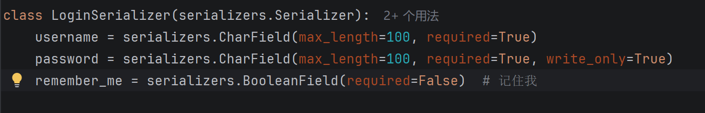

## 设置后端
### settings.py
```python
from datetime import timedelta
SIMPLE_JWT = {  
    'ACCESS_TOKEN_LIFETIME': timedelta(minutes=15),  # 访问令牌短效  
    'REFRESH_TOKEN_LIFETIME': timedelta(days=30),  # "记住我"的核心：30天免登录  
	'ROTATE_REFRESH_TOKENS': True,  # 每次刷新时轮换 Refresh Token  
	'BLACKLIST_AFTER_ROTATION': True,  # 旧 Refresh Token 立即失效，防止被盗用  
}
```
如果用户勾选了"记住我"，Refresh Token 有效期长达 30 天。一旦泄露风险极高。开启轮换后，每次用 Refresh Token 换取新 Access Token 时，会同时颁发一个新的 Refresh Token 并将旧的加入黑名单。这样即使旧令牌被盗，也会在下次合法使用时被发现并自动作废。

### 登录接口支持“记住我”参数
**serializers.py:**

**views.py**
