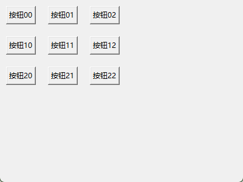
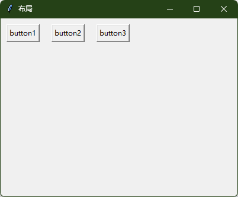
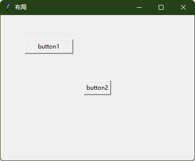

# 基本组件
### 主窗口：
```python
import tkinter as tk

# 创建主窗口
root = tk.TK()
root.title("系统时钟")  # 名称
root.geometry("400x100+200+200")  # 窗口大小

# 进入事件主循环
root.mainloop()
```
### 标签（Label）
```python
# 创建标签
time_label = tk.Label(root, text="08:41:04", font=("Arial", 60),fg="red")
# 将标签添加到主窗口
time_label.pack()
```
### 按钮（Button）
```python
def button_click():
	print("按钮被点击了")
	label.config(text="按钮被点击了")
	
button = tk.Button(root, text="点击我", command=button_click)

button.pack()
```
### 单行文本框（输入框）（Entry）
```python
entry = tk.Entry(root, width=30)
entry.pack()

# 获取输入的值
def button_click2():  
    value = entry.get()  
    time_label.config(text=value)  
button1 = tk.Button(root, text="获取输入", command=button_click2)  
button1.pack()
```
### 多行文本框（Text）
```python
text = tk.Text(root, height=5, width=30)  
text.pack()

def get_text_value():  
    value = text.get("1.0", tk.END)  # <- 从第一行第零列到末尾
    print(f'文本框的值是：{value}')  
button2 = tk.Button(root, text="获取输入", command=get_text_value)  
button2.pack()
```
### 单选按钮（Radiobutton）
```python
var = tk.StringVar(value="A")  # 默认选择A
radio1 = tk.Radiobutton(root, text="选项A", variable=var, value="A")
radio2 = tk.Radiobutton(root, text="选项B", variable=var, value="B")
radio1.pack()
radio2.pack()
# 获取选择的值
def get_radio_value():
    print(f"选择的值是: {var.get()}")
button = tk.Button(root, text="获取选择", command=get_radio_value)
button.pack()
```
### 复选框（Checkbutton）
```python
import tkinter as tk  
  
root = tk.Tk()  
root.title("复选框控件的使用")  
root.geometry("400x300+200+200")  
  
var1 = tk.IntVar()  
var2 = tk.IntVar()  
var3 = tk.IntVar()  
var4 = tk.IntVar()  
  
check1 = tk.Checkbutton(root, text="篮球", variable=var1)  
check1.pack()  
check2 = tk.Checkbutton(root, text="足球", variable=var2)  
check2.pack()  
check3 = tk.Checkbutton(root, text="羽毛球", variable=var3)  
check3.pack()  
check4 = tk.Checkbutton(root, text="排球", variable=var4)  
check4.pack()  
  
def get_hobby():  
    hobby = ""  
    if var1.get() == 1:  
       hobby += "篮球 "    if var2.get() == 1:  
       hobby += "足球 "    if var3.get() == 1:  
       hobby += "羽毛球 "    if var4.get() == 1:  
       hobby += "排球 "    label.config(text="您选择的兴趣爱好是：" + hobby)  
  
button = tk.Button(root, text="获取选中的选项", command=get_hobby)  
button.pack()  
label = tk.Label(root, text="您选择的兴趣爱好是：")  
label.pack()  
  
root.mainloop()
```


# 布局管理
### pack 布局

```python
import tkinter as tk  
from tkinter import mainloop  
  
root = tk.Tk()  
root.title("布局")  
root.geometry("400x300+200+200")  
  
button1 = tk.Button(root, text="button1")  
button1.pack(side="left", padx=10)  # 左对齐，左右编剧10像素  
  
button2 = tk.Button(root, text="button2")  
button2.pack(side="right", padx=10)  # 右...  
  
button3 = tk.Button(root, text="button3")  
button3.pack(pady=10)  # 剧中，上下10px  
  
var = tk.IntVar()  
root.mainloop()
```
### grip布局
```python
import tkinter as tk  
  
root = tk.Tk()  
root.title("布局")  
root.geometry("400x300+200+200")  
  
for i in range(3):  
    for j in range(3):  
        button = tk.Button(root,text=f"按钮{i}{j}")  
        button.grid(row=i,column=j, padx=10, pady=10)  
  
var = tk.IntVar()  
root.mainloop()
```

```python
import tkinter as tk  
  
root = tk.Tk()  
root.title("布局")  
root.geometry("400x300+200+200")  
  
# for i in range(3):  
#     for j in range(3):  
#         button = tk.Button(root,text=f"按钮{i}{j}")  
#         button.grid(row=i,column=j, padx=10, pady=10)  
  
button1 = tk.Button(root, text="button1")  
button1.grid(row=0,column=0,padx=10,pady=10)  
button2 = tk.Button(root, text="button2")  
button2.grid(row=0,column=1,padx=10,pady=10)  
button3 = tk.Button(root, text="button3")  
button3.grid(row=0,column=2,padx=10,pady=10)  
  
var = tk.IntVar()  
root.mainloop()
```

### palse布局
精确控制
```python
import tkinter as tk  
  
root = tk.Tk()  
root.title("布局")  
root.geometry("400x300+200+200")  
  
button1 = tk.Button(root, text="button1")  
button1.place(x=50, y=50, width=100, height=30)  # x,y为左上角坐标  
button2 = tk.Button(root, text="button2")  
button2.place(relx=0.5, rely=0.5, anchor=tk.CENTER)   # 相对位置，居中对齐  
  
var = tk.IntVar()  
root.mainloop()
```

# 事件处理
### 事件绑定基础
在tkinter中，事件绑定通过 `widget.bind(event, halder)`方法实现：
+ widget：需要响应的组件
+ event：事件类型，使用字符串表示（如 `<Button-l>`表示鼠标左键点击）
+ handler：事件处理函数，当事件发生时调用
**例如：鼠标点击事件**
```python
import tkinter as tk  
  
root = tk.Tk()  
root.title("事件处理")  
root.geometry("400x300+200+200")  
  
def on_click(event):  
    label.config(text=f"点击位置：x = {event.x},y = {event.y}")  
  
button = tk.Button(root, text="点击我")  
button.bind("<Button-1>", on_click)  # 绑定左键点击事件  
button.bind("<Button-3>", on_click)  # 绑定右键点击事件  
button.pack()  
label = tk.Label(root, text="")  
label.pack()  
  
root.mainloop()
```

### 常见事件类型
这是根据图片内容整理的 Markdown 表格代码：

#### (1) 鼠标事件

|事件名称|描述|
|:--|:--|
|`<Button-1>`|鼠标左键点击|
|`<Button-2>`|鼠标中键点击|
|`<Button-3>`|鼠标右键点击|
|`<Double-1>`|双击鼠标左键|
|`<B1-Motion>`|按住左键并移动|
|`<ButtonRelease-1>`|释放左键|
|`<Enter>`|鼠标进入控件区域|
|`<Leave>`|鼠标离开控件区域|

#### (2) 键盘事件

|事件名称|描述|
|:--|:--|
|`<Key>`|任意键按下|
|`<KeyPress-A>`|按下 A 键（可替换为其他键）|
|`<KeyRelease>`|释放任意键|
|`<Control-V>`|组合键 (Ctrl+V)|

#### (3) 窗口事件

|事件名称|描述|
|:--|:--|
|`<Configure>`|窗口大小或位置改变|
|`<FocusIn>`|控件获得焦点|
|`<FocusOut>`|控件失去焦点|
|`<Destroy>`|控件被销毁|
这是图片中的文字内容以及对应的代码块：

### 3、事件对象

当事件触发时，Tkinter 会将一个事件对象传递给处理函数，包含事件的详细信息：

- `event.x`, `event.y`：鼠标坐标（相对于控件）。
- `event.widget`：触发事件的控件。
- `event.keycode`：键盘按键的代码。
- `event.char`：键盘输入的字符（仅键盘事件）。

#### 键盘事件示例

```python
# 获取键盘输入，显示按键信息及键码
import tkinter as tk

root = tk.Tk()
root.title("事件处理")
root.geometry("400x300+200+200")

def on_key_press(event):
    label.config(text=f"按下键: {event.char} \n (键码: {event.keycode})")

root.bind("<Key>", on_key_press)  # 绑定全局键盘事件
label = tk.Label(root, text="")
label.pack()

root.mainloop()
```

### 4、事件绑定的两种方式

#### (1) 使用 `bind()` 方法

```python
button = tk.Button(root, text="按钮")
button.bind("<Button-1>", lambda e: print("按钮被点击"))
```

#### (2) 使用 `command` 参数（仅适用于部分控件）

```python
button = tk.Button(root, text="按钮", command=lambda: print("按钮被点击"))
```

#### 区别：

- `bind()` 更灵活，可以绑定多种事件类型。
- `command` 仅适用于支持 `command` 参数的控件（如按钮）。

### 5、事件绑定综合示例

```python
import tkinter as tk

def handle_event(event):
    event_type = event.type
    widget = event.widget
    x, y = event.x, event.y
    print(f"事件类型: {event_type}, 控件: {widget}, 位置: ({x}, {y})")

root = tk.Tk()
root.geometry("300x200")

# 1. 鼠标事件
button = tk.Button(root, text="点击我")
button.bind("<Button-1>", lambda e: print("左键点击"))
button.bind("<Button-3>", lambda e: print("右键点击"))
button.pack(pady=10)

# 2. 键盘事件（绑定到整个窗口）
root.bind("<Key>", lambda e: print(f"按下键: {e.char}"))
root.bind("<Control-q>", lambda e: root.quit())  # Ctrl+Q 退出程序


# 3. 窗口事件
root.bind("<Configure>", lambda e: print(f"窗口大小: {e.width}x{e.height}"))

# 4. 鼠标进入/离开事件
label = tk.Label(root, text="悬停此处")
label.bind("<Enter>", lambda e: label.config(bg="yellow"))
label.bind("<Leave>", lambda e: label.config(bg="SystemButtonFace"))
label.pack(pady=10)

root.mainloop()
```
