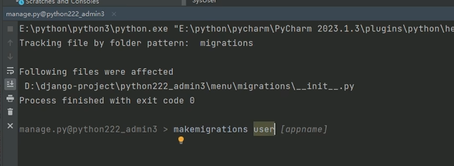
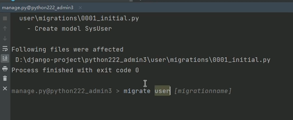
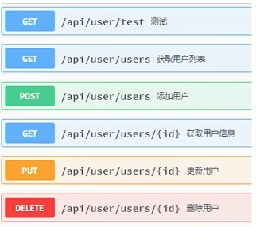

## 后端架构搭建
1. 创建django项目
2. 在settings.py中删除如下内容
	
	此admin是django自带的管理系统，防止请求冲突
3. 依次点击**工具，运行**

 
4. 在底部输入以下内容来创建app，user可以更改为app名
	
5. 在settings.py中添加以下内容
	
6. 管理url
	+ 在父模块的urls中include一下子模块，include需要提前import一下
	+ 上一步写入后先备注掉，不然之后运行项目会报错
7. 链接数据库
	1. 更改manage.py中的配置
		
	2. 创建一个数据库
	3. 在model中创建实体如下：
		
	4. 生成sql：
		+ 生成迁移文件：
			
		+ 执行迁移文件：
			
		+ 在MySQL中写下以下代码来创建测试用户：
			```sql
			insert into `sys_user` (id, username, password, avatar, email, phonenumber, login_date, status, create_time, update_time, remark) VALUES ('3', '1', '123456','20240906202303.jpg','confeng2014@126.com','1862857104','2024-08-08','0','2024-08-08','2024-08-14','测试用户');  
			insert into `sys_user` (id, username, password, avatar, email, phonenumber, login_date, status, create_time, update_time, remark) VALUES ('6', '4', '123456','20240906202303.jpg',null,null,null,'1',null,null,null);  
			insert into `sys_user` (id, username, password, avatar, email, phonenumber, login_date, status, create_time, update_time, remark) VALUES ('7', '5', '123456','20240906202303.jpg',null,null,null,'1',null,null,null);  
			insert into `sys_user` (id, username, password, avatar, email, phonenumber, login_date, status, create_time, update_time, remark) VALUES ('8', '6', '123456','20240906202303.jpg',null,null,null,'0',null,null,null);  
			insert into `sys_user` (id, username, password, avatar, email, phonenumber, login_date, status, create_time, update_time, remark) VALUES ('11', '9', '123456','20240906202303.jpg',null,null,null,'1',null,null,null);  
			insert into `sys_user` (id, username, password, avatar, email, phonenumber, login_date, status, create_time, update_time, remark) VALUES ('14', '666', '123456','default.jpg','confeng2014@126.com','1862857104',null,'1','2024-08-13',null,'33');  
			insert into `sys_user` (id, username, password, avatar, email, phonenumber, login_date, status, create_time, update_time, remark) VALUES ('15', 'jack', '123456','default.jpg','confeng2014@126.com','1862857104',null,'1','2024-08-13','2024-09-06','禁止用户测试4');  
			insert into `sys_user` (id, username, password, avatar, email, phonenumber, login_date, status, create_time, update_time, remark) VALUES ('16', '12323232', '123456','default.jpg','1@126.com','1862857104',null,'1','2024-08-18','2024-08-18','115');  
			insert into `sys_user` (id, username, password, avatar, email, phonenumber, login_date, status, create_time, update_time, remark) VALUES ('17', 'marry', '123456','default.jpg','111@qq.com','15586521012',null,'1','2024-09-05',null,'555')
			```
8. 开发接口
	1. Restful规范：
		
	2. 