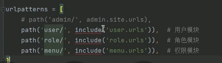
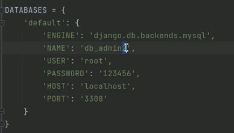
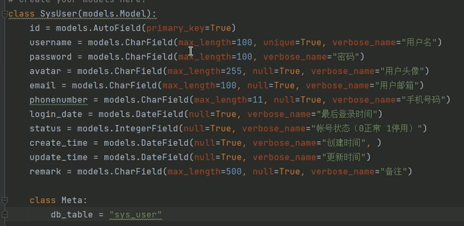

## 后端架构搭建
1. 创建django项目
2. 在settings.py中删除如下内容
	
	此admin是django自带的管理系统，防止请求冲突
3. 依次点击**工具，运行**

 
4. 在底部输入以下内容来创建app，user可以更改为app名
	
5. 在settings.py中添加以下内容
	
6. 管理url
	+ 在父模块的urls中include一下子模块，include需要提前import一下
	+ 上一步写入后先备注掉，不然之后运行项目会报错
7. 链接数据库
	1. 更改manage.py中的配置
		
	2. 创建一个数据库
	3. 在model中创建实体如下：
		
	4. 