## 基础

git config --global user.name []         设置用户签名

git config --global user.email []         设置用户签名
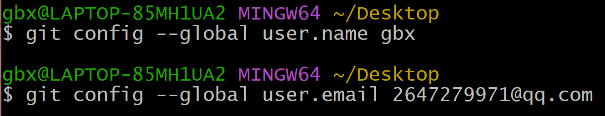

**git init              初始化本地库**

git status        查看状态
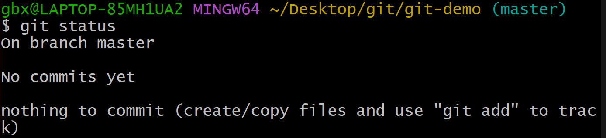
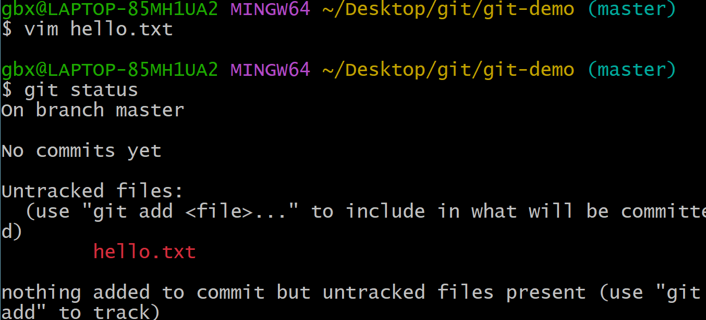

git add         添加暂存区
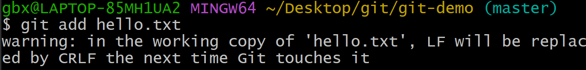
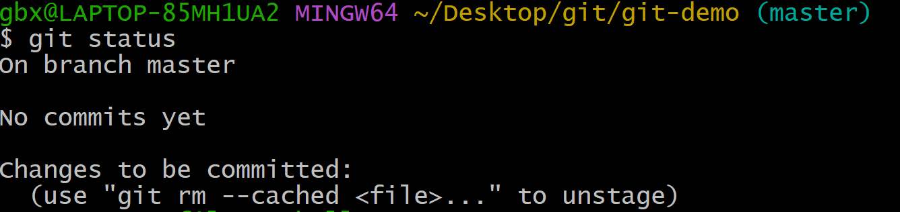

git rm --cached       删除暂存区的文件（工作区没被删除）
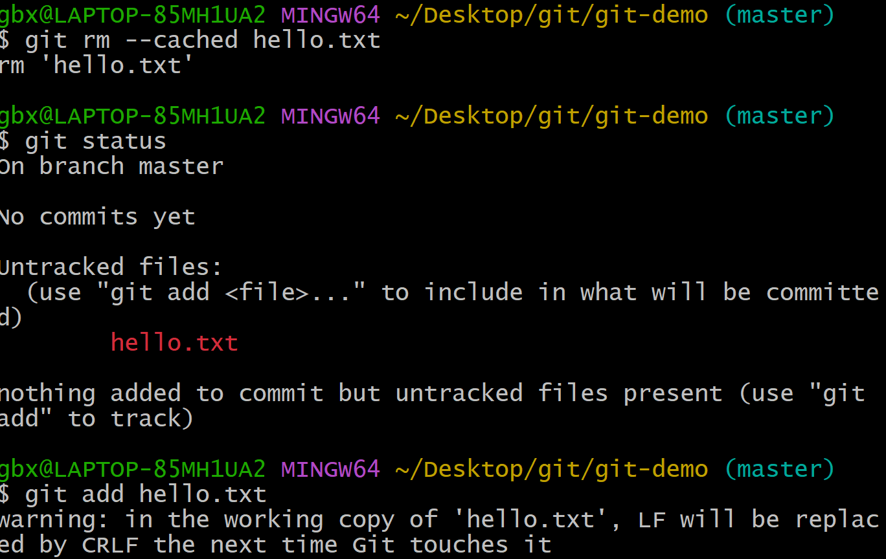

git commit -m "日志信息" 文件名     提交本地库

+ 其中高亮显示的是七位的版本号
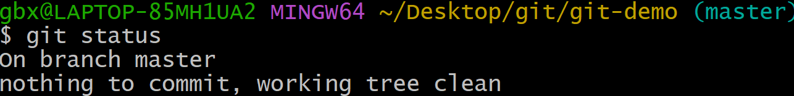

git reflog    或者    git log        查看版本信息
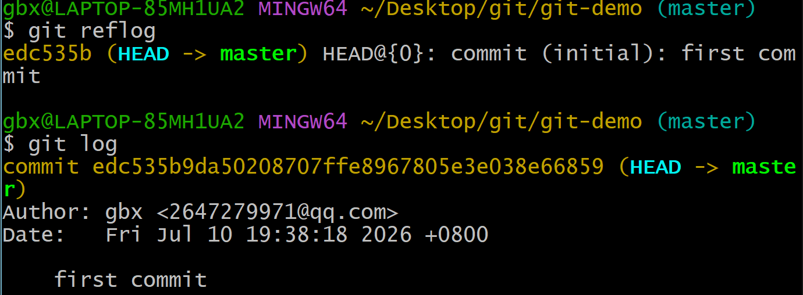

修改文件并提交：

git reset --hard 版本号          穿梭版本

## 分支
gti bransh -v         查看分支
git branch 分支名        创建分支

git chekout        切换分支
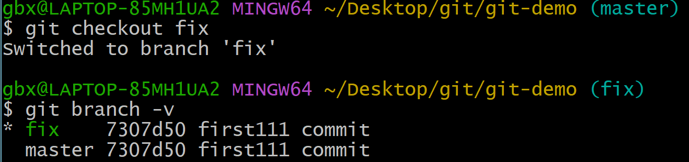

gti merge 要合并的分支
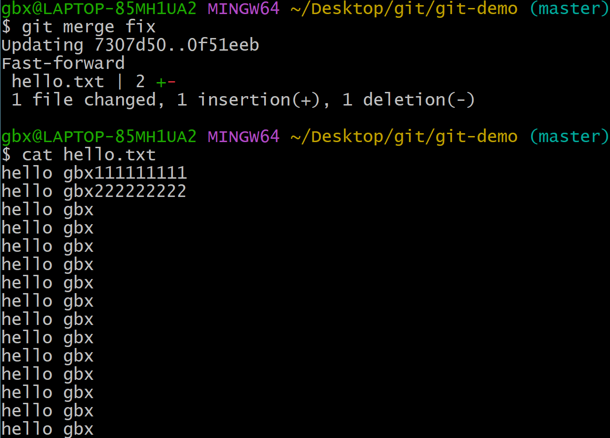

## 团队协作
#### 团队内协作：

##### 添加成员到自己的团队
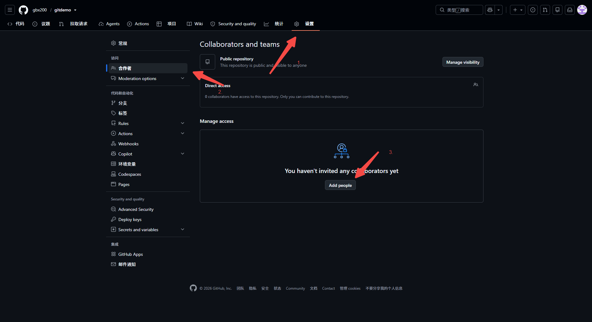

#### 跨团队协作：

##### fork到自己仓库修改

## GitHub操作
创建仓库
https://github.com/gbx200/gitdemo.git

git remote add 别名 http          创建别名
git remote -v                            查看别名

git push 别名 分支名                推送

git pull 别名 分支名                 拉取库到本地

git clone https：//······           克隆仓库（不需要登录）

