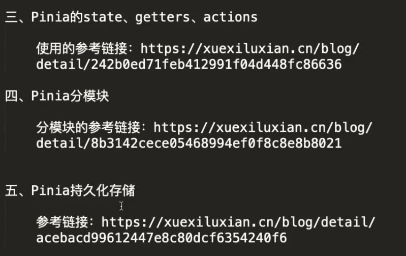

根据你提供的大作业要求，你的Vue3和DRF入门基础是一个不错的起点。要在45天内完成该项目，你需要补充以下关键知识和技能，并制定合理的时间规划。下面列出**还需要学习的内容**，按照技术栈和项目阶段分类，并给出优先级（P0表示必须掌握、P1表示重要、P2表示可选或较容易上手）。

---

## 一、前端补充知识（基于已有Vue3入门）

| 知识点 | 为何需要 | 优先级 | 建议学习方式 |
|--------|----------|--------|--------------|
| **Vue Router 进阶**（命名视图、导航守卫、路由元信息、动态路由） | 作业要求前端路由设计，权限控制需要导航守卫 | P0 | 官方文档 + 小型demo |
| **Pinia 状态管理**（理解Store、actions、getters、组合式写法） | 作业明确要求使用Pinia，避免全局变量滥用 | P0 | 看官方示例，整合到项目中 |
| **Axios 封装**（拦截器、统一错误处理、基于token刷新） | 必须封装请求模块，JWT认证需要拦截token | P0 | 自己写一个utils/request.js |
| **Composition API 深入**（ref/reactive、watchEffect、provide/inject、组合函数） | 要求必须使用Composition API组织代码 | P0 | 复习已有基础，练习提取复用逻辑 |
| **Element Plus / Ant Design Vue** | 快速构建后台管理系统UI | P1 | 按需引入，参考文档 |
| **Vitest 组件/函数测试** | 要求前端至少5个单元测试用例 | P1 | 学习Vitest基本语法，对工具函数和简单组件写测试 |
| **TypeScript**（可选） | 非必须但如果使用大大提高代码质量 | P2 | 时间充裕可简单入门 |

---

## 二、后端补充知识（基于已有DRF入门）

| 知识点 | 说明 | 优先级 | 建议学习方式 |
|--------|------|--------|--------------|
| **DRF 基于类的视图高级用法**（ViewSet、ModelViewSet、Router、自定义action） | 作业要求基于CBV构建API，这是核心 | P0 | 官方教程，重写一个增删改查模块 |
| **JWT 认证**（djangorestframework-simplejwt） | 必须实现JWT身份认证及权限控制 | P0 | 配置simplejwt，实现登录/刷新/验证 |
| **自定义权限类**（IsAuthenticated、自定义权限） | 权限控制 | P0 | 写一个IsOwnerOrReadOnly等 |
| **DRF 序列化器进阶**（嵌套序列化、验证、自定义字段） | 复杂业务需要 | P0 | 对照官方文档实战 |
| **Django 数据库操作优化**（MySQL配置、索引、select_related/prefetch_related） | 作业要求建立索引与约束，性能要求 | P1 | 学习ORM性能优化，在model中加db_index |
| **Django 中间件/异常处理** | 要求至少使用一个中间件或自定义异常处理 | P1 | 写一个简单的操作日志中间件或统一异常响应 |
| **Django TestCase / pytest** | 后端核心逻辑覆盖率≥70% | P0 | 学习DRF的APITestCase，编写测试 |
| **Swagger/DRF Spectacular** | 自动生成API文档，方便撰写手册 | P1 | 安装配置，导出yaml |
| **Gunicorn + Supervisor 部署** | 用于生产环境部署 | P0 | 跟随部署教程，在ECS上实践 |
| **CORS 配置** | 前后端分离必须处理跨域 | P0 | django-cors-headers |

---

## 三、数据库

| 知识点 | 说明 | 优先级 |
|--------|------|--------|
| **MySQL 8.0 安装与配置**（字符集、远程访问） | 作业要求MySQL 8.0+ | P0 |
| **表设计原则**（主键、外键、索引、约束、规范化） | 必须合理设计，ER图工具（draw.io / dbdiagram） | P0 |
| **数据迁移**（Django makemigrations/migrate，注意MySQL引擎） | 常规操作，但需了解InnoDB | P1 |

基本上掌握这些即可，更多是实战中学习。

---

## 四、版本控制与团队协作

| 知识点 | 优先级 | 说明 |
|--------|--------|------|
| **Git高级操作**（分支管理、rebase、merge、冲突解决） | P0 | 需要功能分支开发，PR审查 |
| **Gitflow 简化策略**（main/develop/feature分支） | P0 | 适合团队的流程 |
| **Codeup 使用**（创建仓库、添加成员、MR/PR操作） | P0 | 阿里云平台，类似GitLab |
| **Pull Request 流程**（添加Reviewer、Approve后合并） | P0 | 团队协作必备 |

---

## 五、服务器与部署

| 知识点 | 优先级 | 说明 |
|--------|--------|------|
| **阿里云ECS 申请与配置**（选择镜像、安全组、ssh） | P0 | 免费试用或学生优惠 |
| **宝塔面板安装与使用**（LNMP环境、网站创建、数据库管理） | P0 | 可视化运维，简化部署 |
| **Nginx 反向代理**（配置location proxy_pass，前后端分离） | P0 | 难点：前端history模式404修复 |
| **Gunicorn + Supervisor 守护Django进程** | P0 | 生产运行必备 |
| **静态文件收集与部署**（django collectstatic，配置MEDIA） | P0 | 确保admin和文件访问正常 |
| **Https/SSL 配置**（可选加分） | P2 | 申请阿里云免费证书 |

建议：先本地熟悉Nginx，再上云。时间紧可先用宝塔的Nginx管理界面，但需理解配置。

---

## 六、CI/CD 与自动化

| 知识点 | 优先级 | 说明 |
|--------|--------|------|
| **阿里云云效流水线**（创建流水线、代码源、构建、部署） | P0 | 分值高，必须实现自动构建部署 |
| **流水线配置细节**（前端安装依赖→测试→构建；后端安装依赖→迁移检查→测试） | P0 | 注意环境变量、构建命令 |
| **主机组连接ECS**（使用云效部署） | P0 | 需要添加阿里云主机并配置 |
| **质量关卡**（测试不通过停止部署） | P1 | 流水线中集成测试步骤 |

---

## 七、测试

| 知识点 | 优先级 | 说明 |
|--------|--------|------|
| **Django TestCase**（APITestCase、工厂方法、覆盖分析） | P0 | 后端核心覆盖率≥70% |
| **pytest-django**（可选，但要求中提到pytest） | P1 | 更灵活，可替代或配合 |
| **Vitest**（前端测试框架基本用法） | P0 | 至少5个用例，对store和组件测试 |
| **Postman 集成测试**（编写脚本批量测试API） | P1 | 输出测试报告，评分有要求 |
| **coverage 工具**（后端覆盖率生成报告） | P0 | 必须展示覆盖率 |

---

## 八、文档

| 知识点 | 优先级 | 说明 |
|--------|--------|------|
| **Markdown 高级用法**（表格、代码块、图片嵌入、图表） | P0 | 所有文档整合到一个md，图文并茂 |
| **ER图工具**（draw.io、excalidraw、dbdiagram.io） | P0 | 数据库设计必画ER图 |
| **API手册编写**（端点、参数、响应示例、错误码） | P0 | 可以用Spectacular自动生成后润色 |
| **测试报告**（汇总通过率、缺陷统计） | P0 | 需要认真编写 |

---

## 九、时间规划建议（45天）

假设你每天能投入4~6小时，以下是阶段分配（其中包含学习与项目并行）：

| 阶段 | 天数 | 核心任务 | 补充学习重点 |
|------|------|----------|--------------|
| **1. 补强基础 & 设计** | 1~10天（10天） | 确定选题、需求分析、角色划分、功能列表；设计ER图、接口定义；学习缺失的技术 | 快速掌握Pinia、ViewSet、JWT、MySQL设计；完成前端路由和组件草图 |
| **2. 编码与测试** | 11~30天（20天） | 前后端编码实现三个核心模块+后台管理；同步编写单元测试；使用Git分支开发 | 边写边学：Axios封装、自定义权限、中间件；开始写测试用例 |
| **3. 部署 & CI/CD & 完善** | 31~40天（10天） | 配置ECS+宝塔+Nginx+Gunicorn；搭建云效流水线；解决部署问题 | 重点学习Nginx配置、流水线YAML、环境变量 |
| **4. 文档 & 答辩准备** | 41~45天（5天） | 撰写最终项目文档（所有章节）、测试报告、截图；答辩PPT练习 | 复习项目细节，准备回答问题 |

> **关键提醒**：测试和CI/CD占分高（共30分），务必在编码阶段就同步编写测试，流水线尽早搭建并跑通一次。不要等到最后。

---

## 十、学习资源推荐（仅官方及权威）

- **Vue3**：https://vuejs.org/guide/introduction.html
- **Pinia**：https://pinia.vuejs.org/
- **Vue Router**：https://router.vuejs.org/
- **Axios**：https://axios-http.com/docs/intro
- **DRF**：https://www.django-rest-framework.org/ （特别是API Guide）
- **DRF JWT（simplejwt）**：https://django-rest-framework-simplejwt.readthedocs.io/
- **MySQL官方文档**：https://dev.mysql.com/doc/
- **宝塔面板**：https://www.bt.cn/
- **Nginx 配置**：https://nginx.org/en/docs/
- **阿里云云效**：https://help.aliyun.com/product/111204.html
- **Vitest**：https://vitest.dev/
- **pytest**：https://docs.pytest.org/
- **draw.io**：https://app.diagrams.net/

---

总之，你现在的基础能让你快速理解前、后端核心逻辑，但还需要大量补充**工程化工具**和**测试部署**知识。45天很紧张，但只要按计划**边学边做**，完全可能完成。建议优先确保**核心业务完整**、**测试覆盖**和**自动部署可访问**，再完善文档和细节。加油！

# pinia
